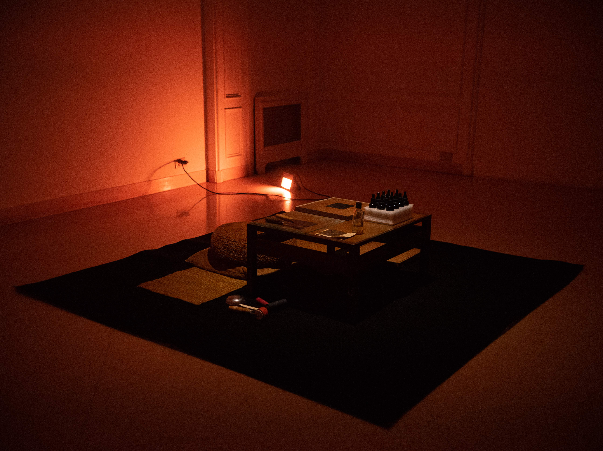
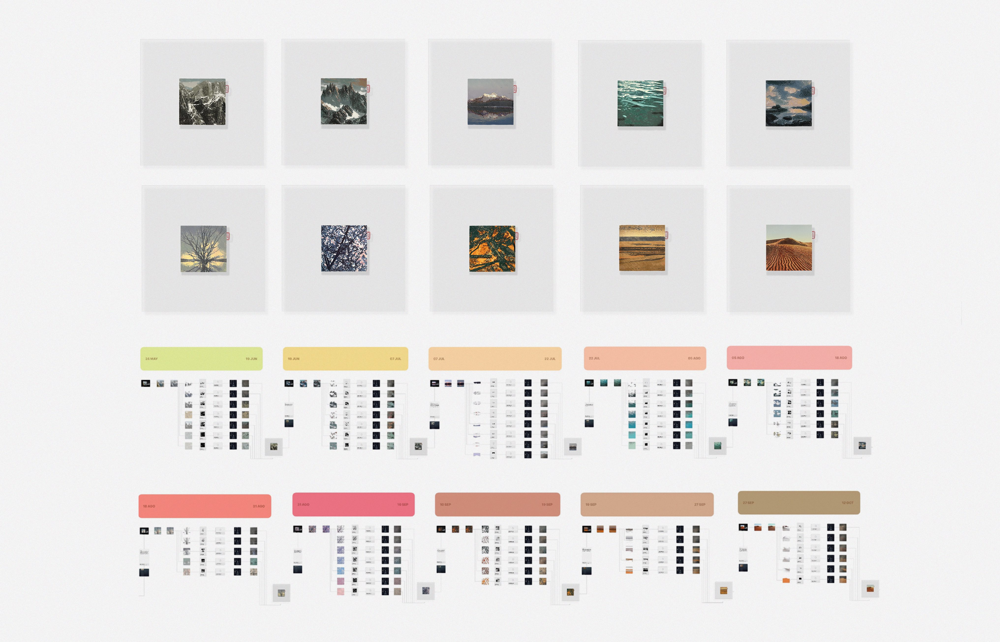
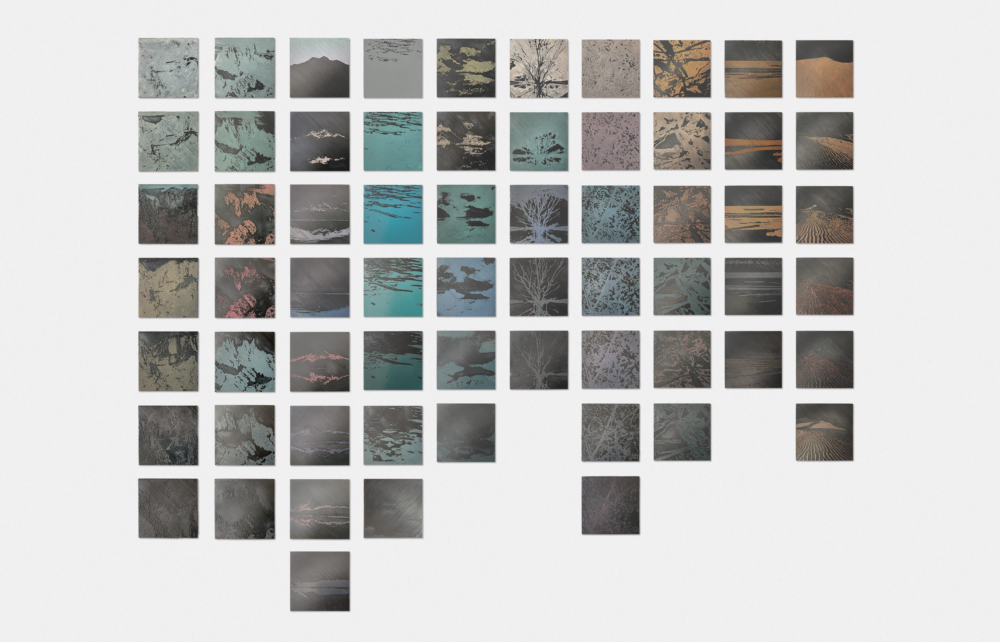
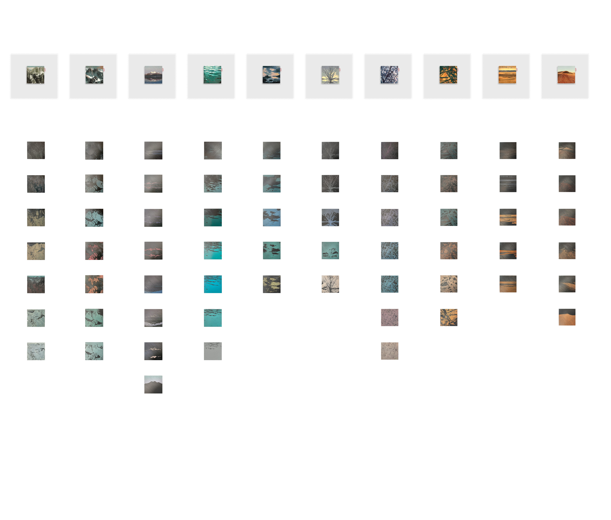

## AUTOMATON

This project combines tradition and development through a procedural work designed to be autonomous. It is composed of a modular system of technologies, which when combined in a cyclical action, produce a series of synthetic graphic impressions. It is a work that has no programmed end and represents the transition from experience to synthesis.

An artificial intelligence generates a descriptive text of the artist's graphic work, recognizing style, color range, pictorial solutions, technique, textures... The resulting information is used as a prompt in another AI that generates images from text. Thus begins a cycle of creation designed to reinterpret and generate realities that replace experience with data. Each new
work generated is the genesis of the next work to be produced.

Date: 05.2023 - 05.2024.  
Technique: Procedural artwork, woodcut prints on acetate paper, AI (image to text + text to image generator), PLA 3D prints.  
Dimensions: Original print and matrixes - 10.5x10.5 cm, Acetate - 30x30 cm.  

[GO BACK](https://aaronrmoreno.github.io/MATERIA)
