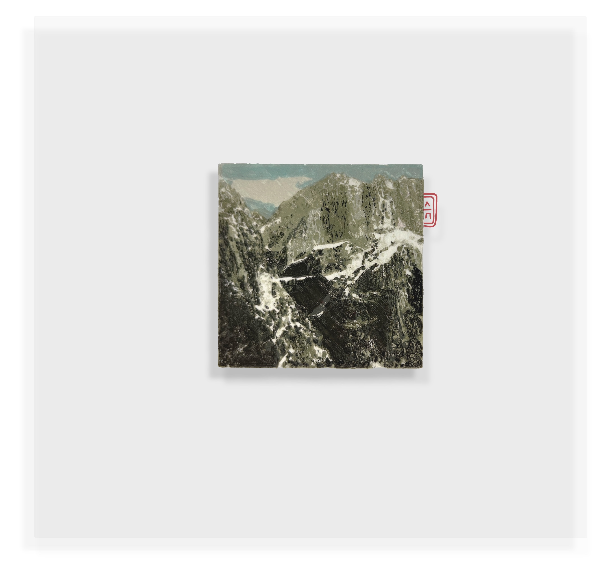
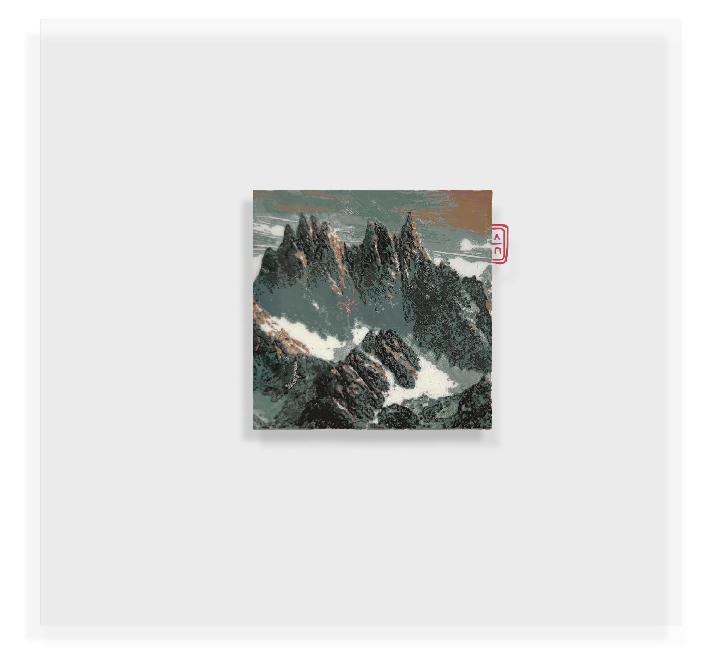
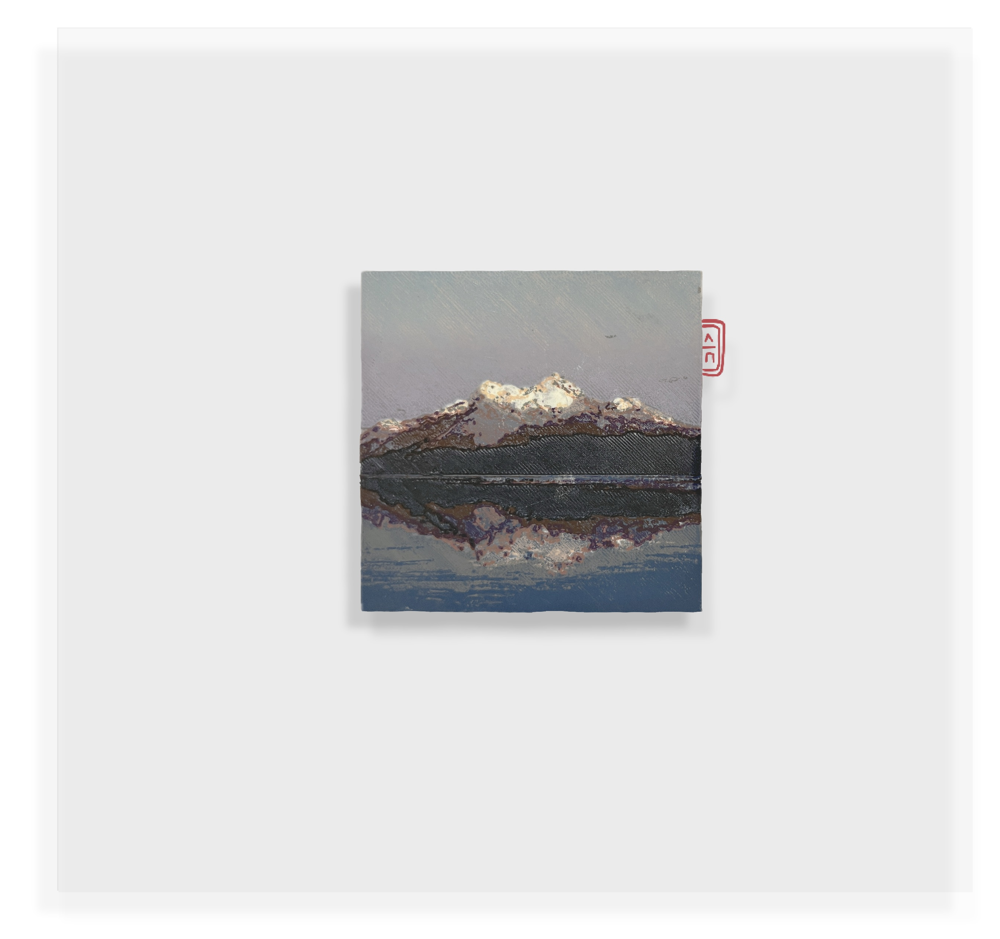
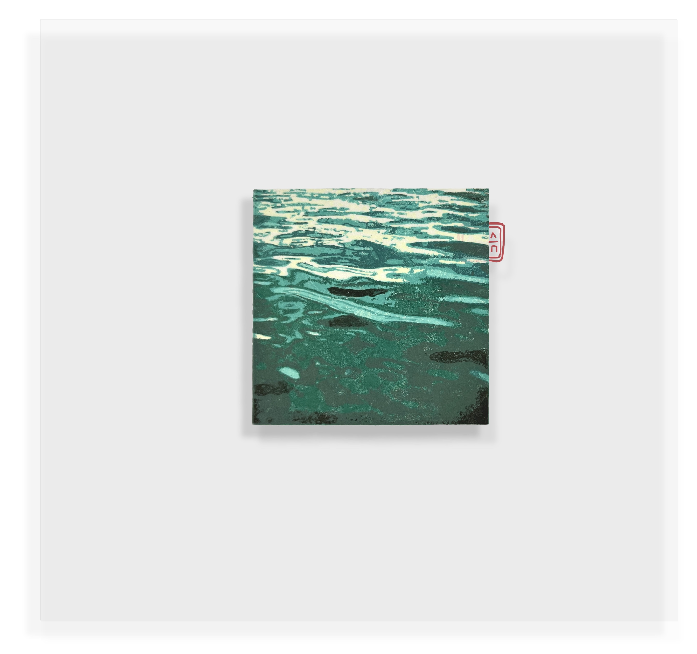
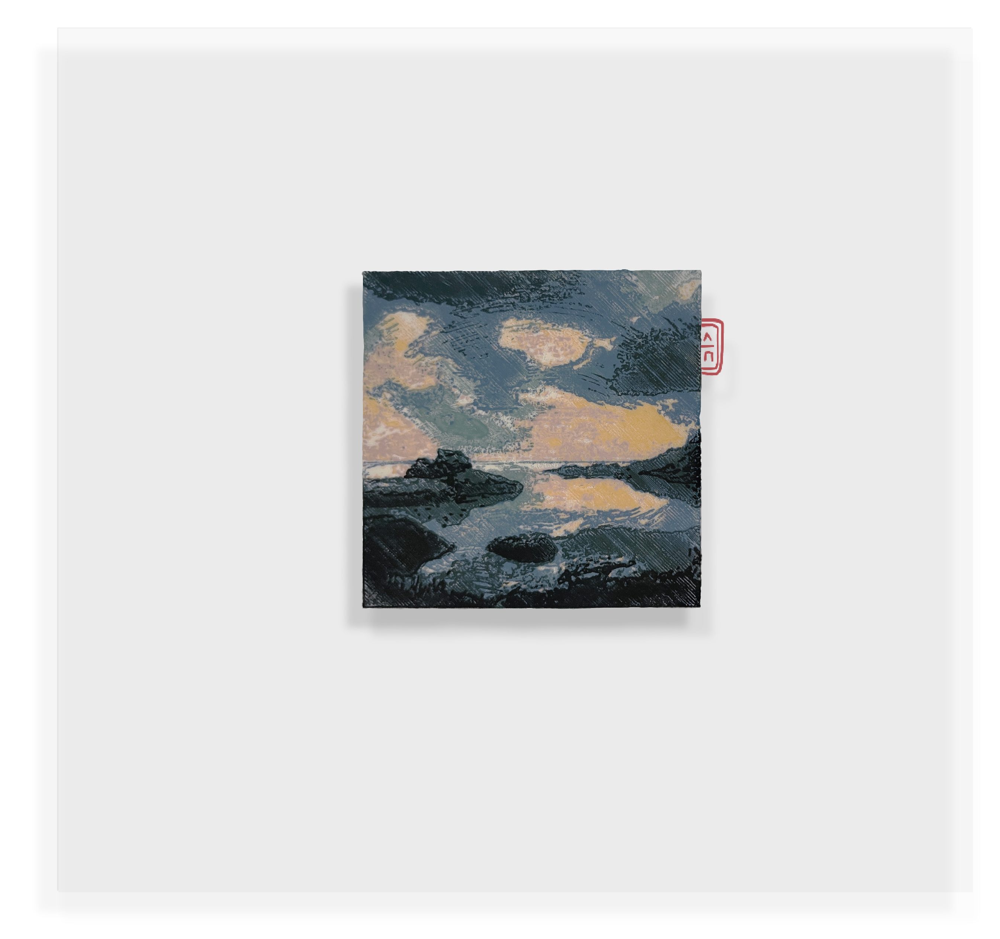
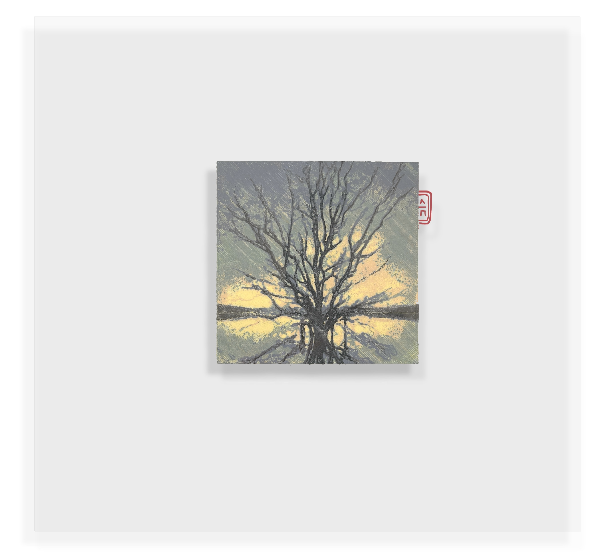
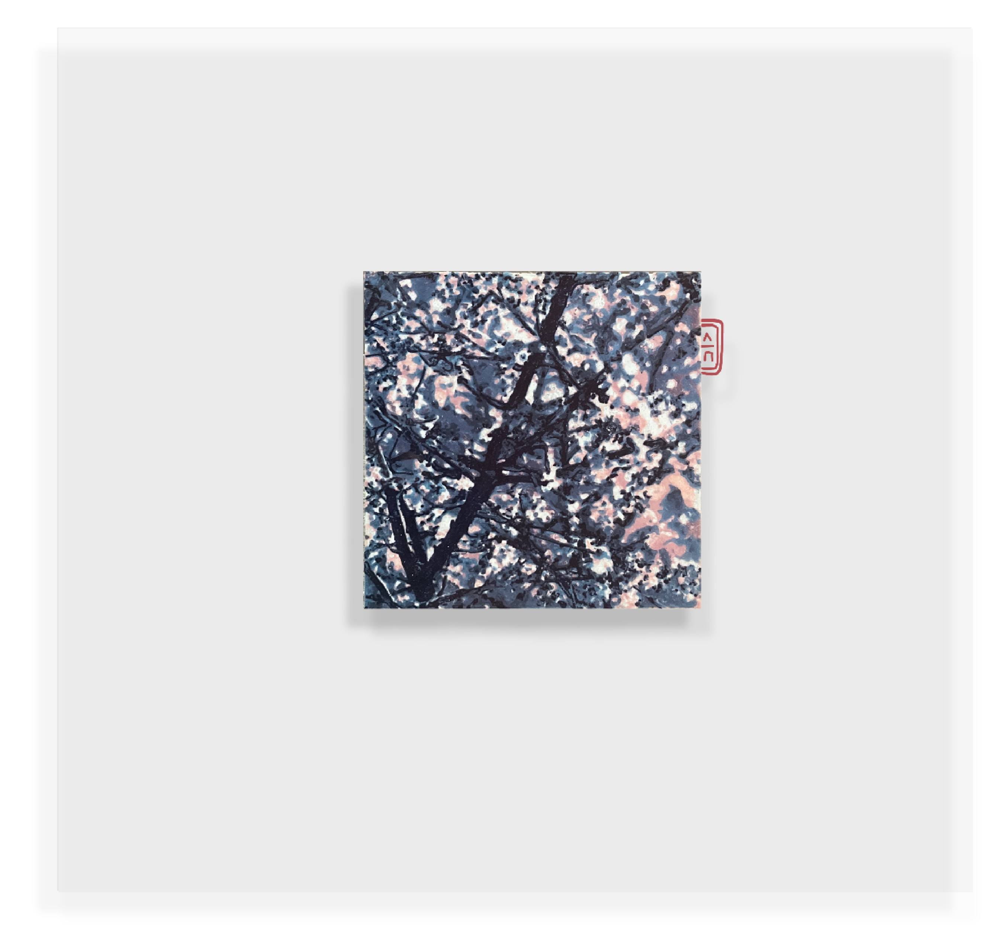
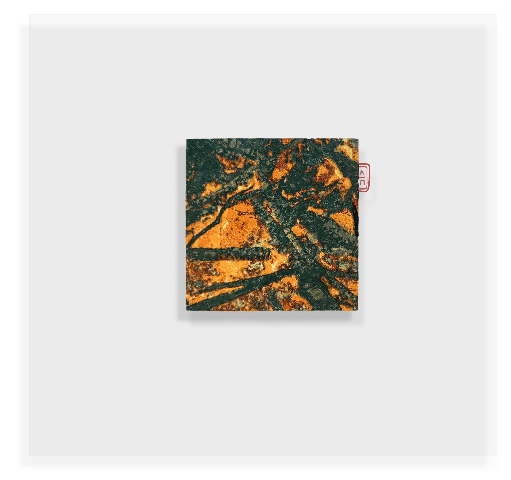
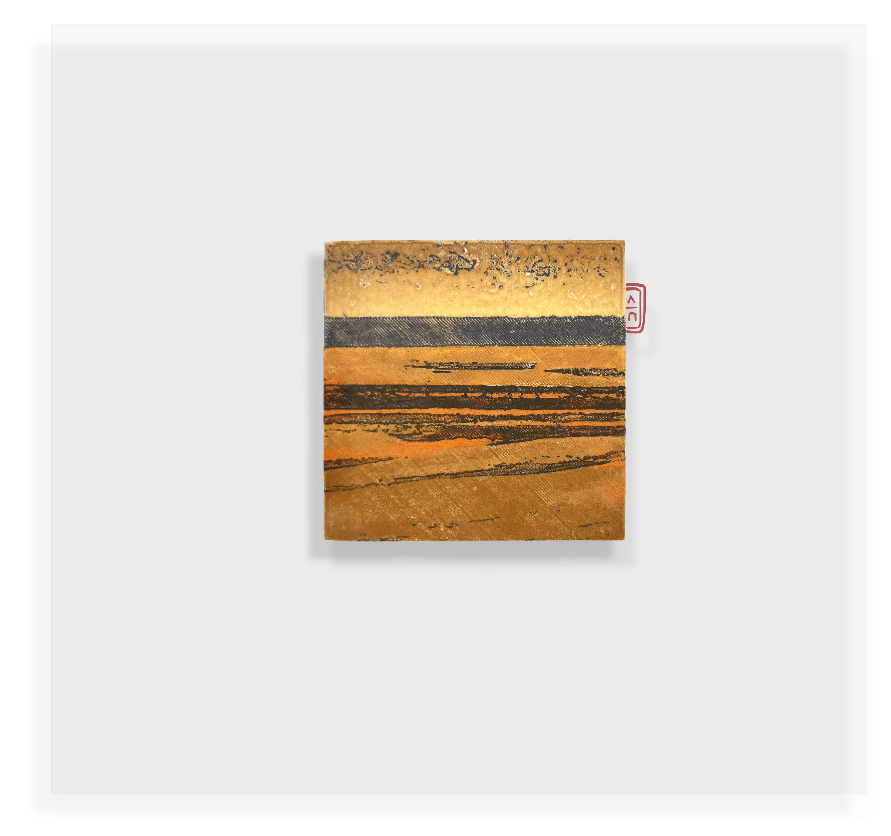
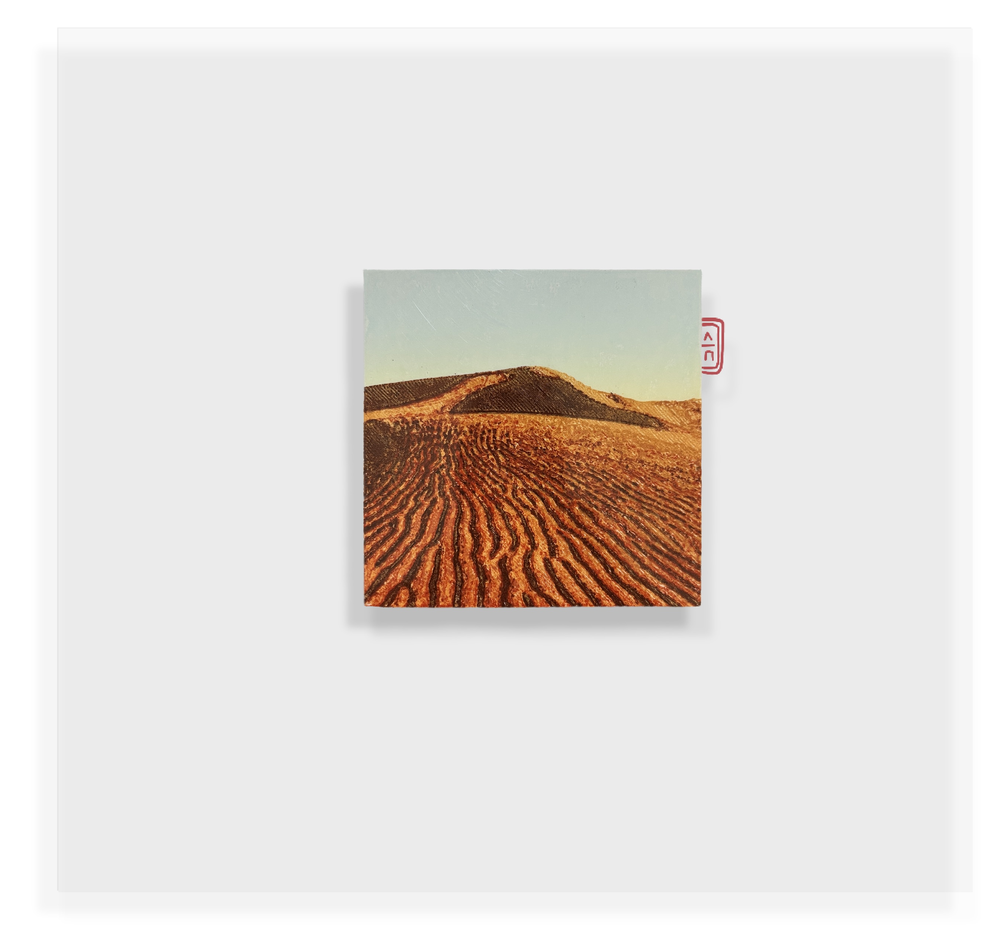

## AUTOMATON

 

This project combines tradition and development through a procedural work designed to be autonomous. It is composed of a modular system of technologies, which when combined in a cyclical action, produce a series of synthetic graphic impressions. It is a work that has no programmed end and represents the transition from experience to synthesis.

An artificial intelligence generates a descriptive text of the artist's graphic work, recognizing style, color range, pictorial solutions, technique, textures... The resulting information is used as a prompt in another AI that generates images from text. Thus begins a cycle of creation designed to reinterpret and generate realities that replace experience with data. Each new
work generated is the genesis of the next work to be produced.

 

Date: 05.2023 - 05.2024.  
Technique: Procedural artwork, woodcut prints on acetate paper, AI (image to text + text to image generator), PLA 3D prints.  
Dimensions: Original print and matrixes - 10.5x10.5 cm, Acetate - 30x30 cm.  

 

Título: INTERACCIÓN 0001.  
PROYECTO AUTOMATON.  
fecha: 19.06.2023.  
Técnica: xilografía sintética (impresa manualmente) Tinta base grasa sobre acetato transparente 0.1mm.   
Edición: 1/3.  
Dimensiones: 35 x 35cm.  

Título: INTERACCIÓN 0002.  
PROYECTO AUTOMATON.  
fecha: 07.07.2023.  
Técnica: xilografía sintética (impresa manualmente) Tinta base grasa sobre acetato transparente 0.1mm.   
Edición: 1/3.  
Dimensiones: 35 x 35cm.  

Título: INTERACCIÓN 0003.  
PROYECTO AUTOMATON.  
fecha: 22.07.2023.  
Técnica: xilografía sintética (impresa manualmente) Tinta base grasa sobre acetato transparente 0.1mm.  
Edición: 1/3.  
Dimensiones: 35 x 35cm. 

Título: INTERACCIÓN 0004.   
PROYECTO AUTOMATON.  
fecha: 05.08.2023.  
Técnica: xilografía sintética (impresa manualmente) Tinta base grasa sobre acetato transparente 0.1mm.    
Edición: 1/3.  
Dimensiones: 35 x 35cm.  

Título: INTERACCIÓN 0005.  
PROYECTO AUTOMATON.  
fecha: 18.08.2023.  
Técnica: xilografía sintética (impresa manualmente) Tinta base grasa sobre acetato transparente 0.1mm.   
Edición: 1/3.  
Dimensiones: 35 x 35cm.  

Título: INTERACCIÓN 0006.  
PROYECTO AUTOMATON.  
fecha: 31.08.2023.  
Técnica: xilografía sintética (impresa manualmente) Tinta base grasa sobre acetato transparente 0.1mm.   
Edición: 1/3
Dimensiones: 35 x 35cm.  

Título: INTERACCIÓN 0007.  
PROYECTO AUTOMATON
fecha: 10.09.2023.  
Técnica: xilografía sintética (impresa manualmente) Tinta base grasa sobre acetato transparente 0.1mm.   
Edición: 1/3
Dimensiones: 35 x 35cm.

Título: INTERACCIÓN 0008.  
PROYECTO AUTOMATON.  
fecha: 19.09.2023.  
Técnica: xilografía sintética (impresa manualmente) Tinta base grasa sobre acetato transparente 0.1mm.  
Edición: 1/3.  
Dimensiones: 35 x 35cm.  

Título: INTERACCIÓN 0009.  
PROYECTO AUTOMATON.  
fecha: 27.09.2023.  
Técnica: xilografía sintética (impresa manualmente) Tinta base grasa sobre acetato transparente 0.1mm.   
Edición: 1/3.  
Dimensiones: 35 x 35cm.  

Título: INTERACCIÓN 0010.  
PROYECTO AUTOMATON.  
fecha: 12.10.2023.  
Técnica: xilografía sintética (impresa manualmente) Tinta base grasa sobre acetato transparente 0.1mm.   
Edición: 1/3.  
Dimensiones: 35 x 35cm.  

 

[GO BACK](https://aaronrmoreno.github.io/MATERIA)
