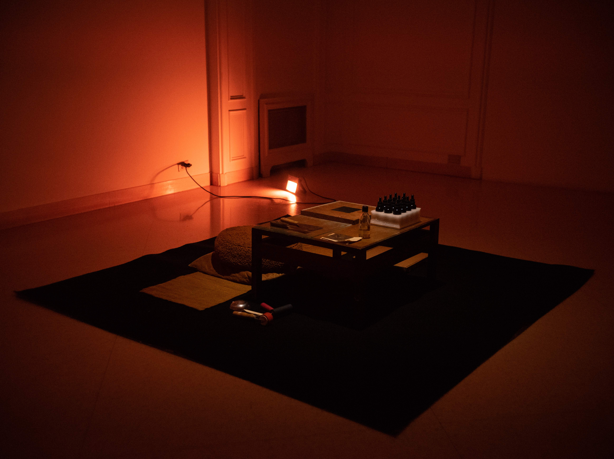

## PENVMBRA

 

This video-mapping was created in a parking lot, next to the bustling Havana promenade called Obispo. The projection captured the lights of the cars entering the area, creating a series of nocturnal stories from Havana: exchanges, sex work, domino tables, rumba dances, crimes, and more. The installation consisted of two overlapping videos, and through interaction with a motion sensor, a digital hole was created in the top video, revealing the stories in a non-linear way. This structure allowed only one person, through their position and movement, to determine what the rest of the audience would see. Thus, the reconstruction of events became a process dependent on the exact time and place of observation. Each viewer could experience the narrative uniquely, as different narrative threads were only revealed at specific moments and positions. In this way, the work transformed the collective experience into a personal and individual one, making each interaction a distinct version of the same story.

 

 
 

[GO BACK](https://aaronrmoreno.github.io/PHOTON)

