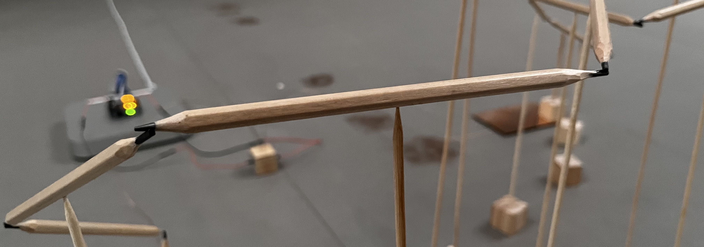

## TOUCH

Installation presented at the Künstlerforum in Bonn, Germany. The work consisted of a closed circuit activated by the contact of graphite. As long as the electronic pulse was flowing through the pencil bridge, the lighting system in that section of the gallery remained on. However, if the connection was interrupted, the gallery was plunged into complete darkness. In a second version, the installation incorporated a sound element: a disruptive noise was generated whenever the signal was interrupted. The intent was to insert an independent system (the artwork) into the pre-existing system (the gallery), creating a relationship of tension. Any imbalance between the two systems resulted in a perceptible conflict, whether through darkness or noise, prompting the viewer to engage in maintaining a harmonious equilibrium.

[GO BACK](https://aaronrmoreno.github.io/MATERIA)
