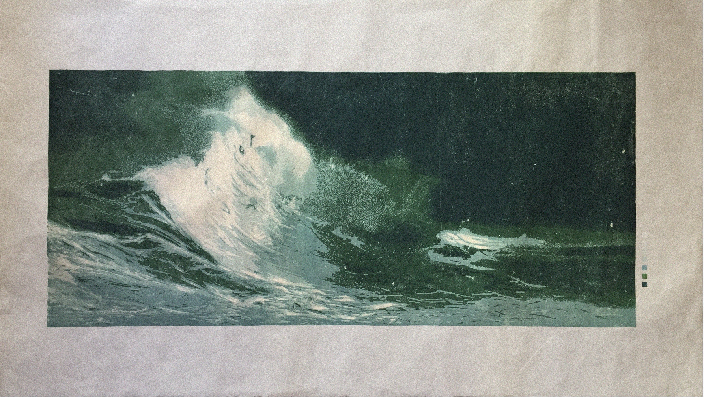

## SEAWEED I & II

This works emerges from experimentation with traditional printmaking techniques. Natural oils extracted from algae were used to alter the properties of linoleum ink, a pigment originally designed to be stable: offering uniform coverage, resistance to oxidation, and durability against light and humidity. When exposed to the raw algae essence, these qualities are disrupted, triggering a series of temporary reactions that become an integral part of the image construction process. The result is a series of portraits created through reduction linocut printing and elements of chance, depicting the environments from which the algae used in the process originate. The work is designed to evolve on its own, transforming the composition of its material as part of its continuous refinement. Currently, the project includes two unique prints.  

-------

Title: I.  
PROJECT SEAWEED.  
Date: 03.2017.  
Technique: woodblock print, ink proceed with seaweed, pulverized sand and filtered salt Edition: 1/1.  
Dimensions: 63 x 113 cm.  
 
 

[GO BACK](https://aaronrmoreno.github.io/MATERIA)
