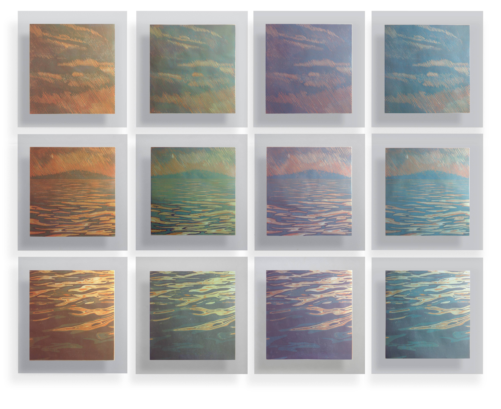

## OVERLAY

This project employs the process of color woodblock printing and its ability to produce multiple editions as a metaphor for the attempts to transform what we perceive by adding new layers of color. However, with each additional layer, the resulting image inevitably fades and blurs, losing its clarity and definition. The work reflects on how change, pursued for the sake of change itself, can lead to the loss of original intentions. In this process, what begins as a search for evolution ultimately erodes the very essence that gave meaning to the whole.

[GO BACK](https://aaronrmoreno.github.io/MATERIA)
