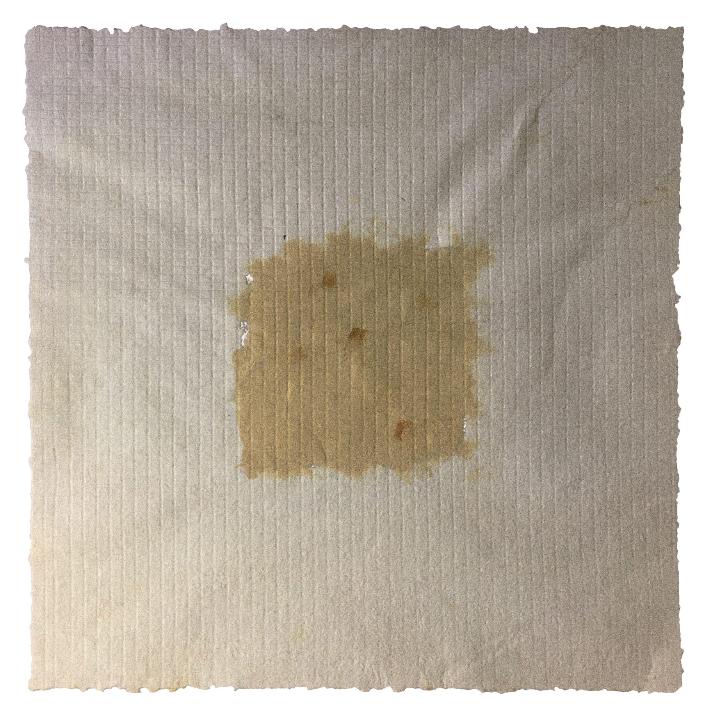

## WHAT ARE WE MADE OF

It is said that 90% of the information the brain processes is visual, and it does so in just 13 milliseconds. That is the main function of the brain while we are awake: to try to understand what we are seeing. This series represents the record of our contact with a real physical space, the remnant of an experience that becomes landscape. The work consists of 12 color woodcuts, printed on handmade paper. In the creation of each sheet, cured organic materials were used, extracted from the same environment represented in the prints. My interest lies in the process of reconstruction of information from experience to form.

 

 
 

[GO BACK](https://aaronrmoreno.github.io/MATERIA)

