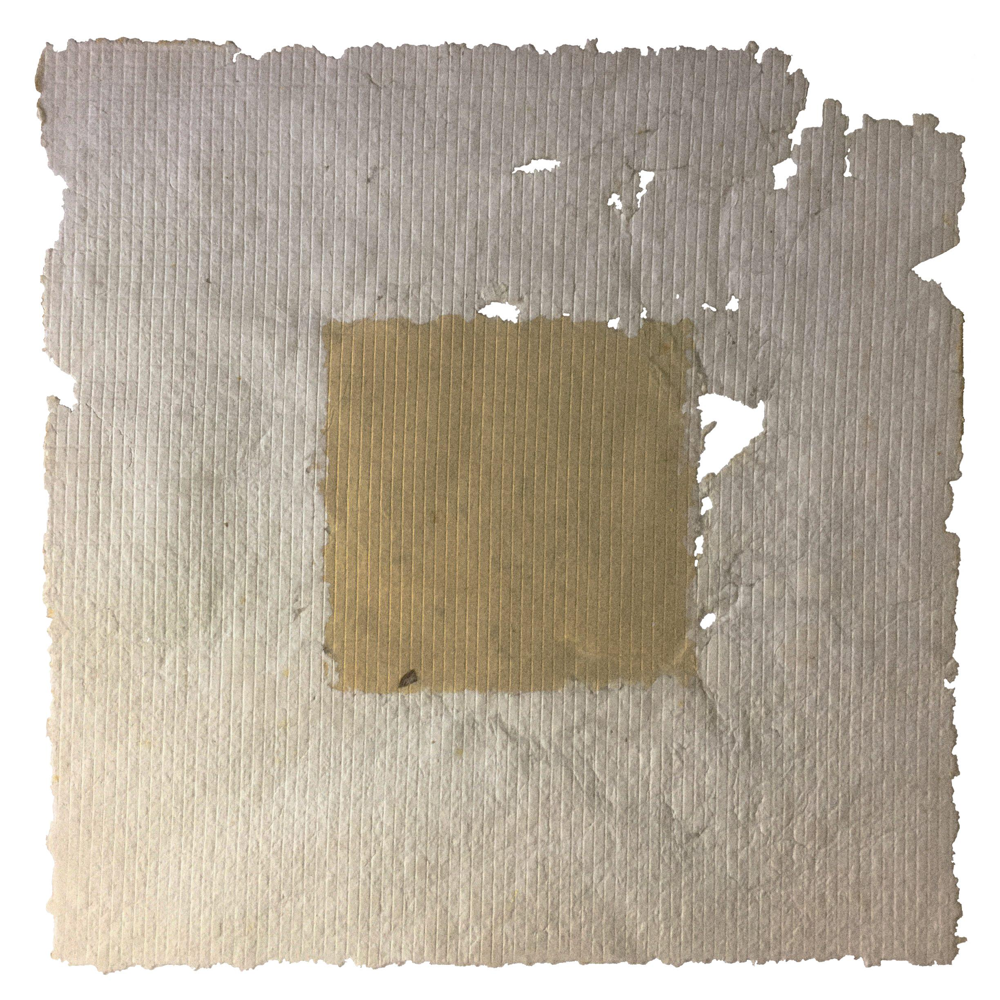
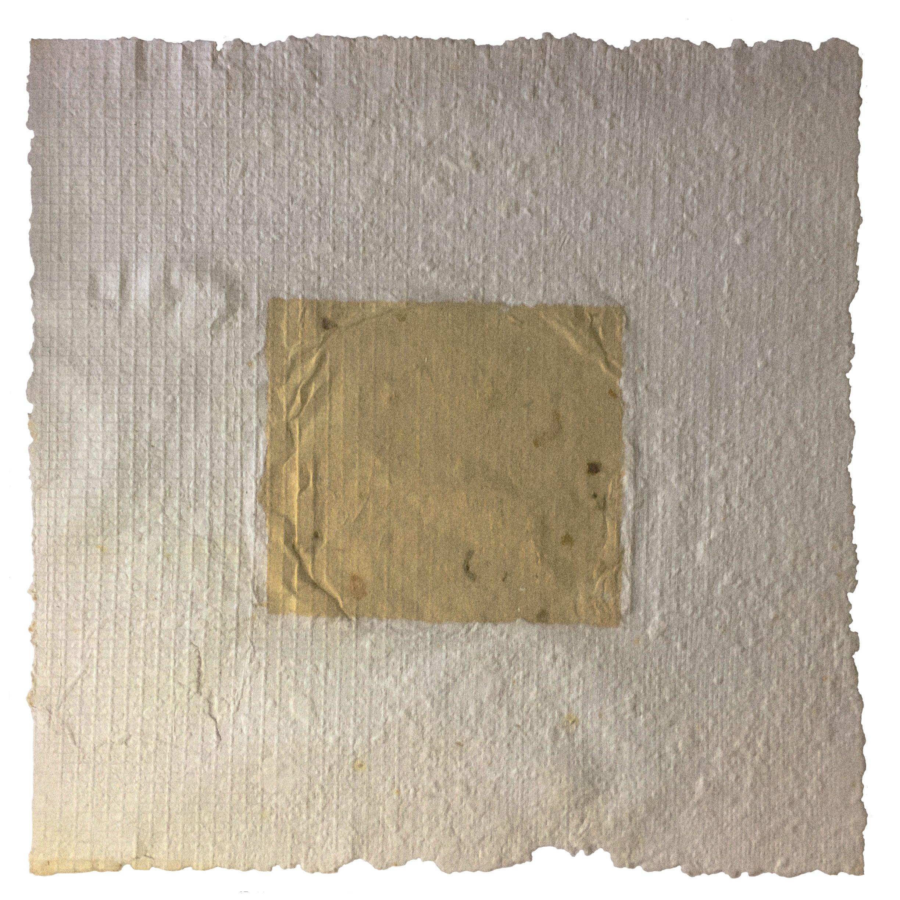

## BELONG 

 

Each page of this series consists of two pieces of handmade paper that, although part of the same sheet, are not presented in a controlled or undisturbed manner. The process of integration between the two elements is intentionally imperfect, reflecting the tensions and challenges inherent in the quest for unity. This dynamic of attempt and fracture defines the work: it is not about a smooth, fluid integration, but rather a process that reveals distortions and ruptures as the two pieces try to converge. In the final result, the very process of seeking cohesion becomes the central message of the work.

 

Date: 09.2011.  
Technique: Handmade organic paper and recycled industrial paper merged in the same sheet.  
Edition: 1/1
Dimensions: 20 x 35 cm.  

 
 

[GO BACK](https://aaronrmoreno.github.io/MATERIA)
